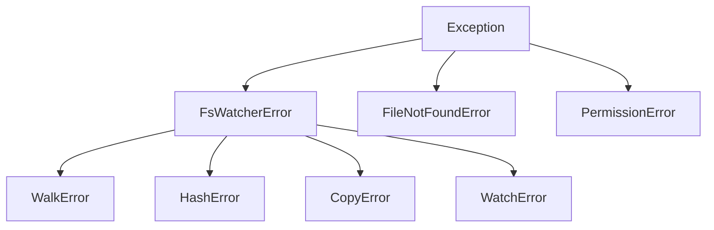

# Exceptions

All pyfs-watcher exceptions inherit from `FsWatcherError`, which itself inherits from Python's built-in `Exception`. Standard `FileNotFoundError` and `PermissionError` are raised for I/O errors.

## Hierarchy



---

## FsWatcherError

```python
class FsWatcherError(Exception)
```

Base exception for all pyfs-watcher errors. Catch this to handle any library-specific error.

```python
try:
    pyfs_watcher.walk_collect("/some/path")
except pyfs_watcher.FsWatcherError as e:
    print(f"pyfs-watcher error: {e}")
```

---

## WalkError

```python
class WalkError(FsWatcherError)
```

Raised when a directory walk operation fails. Typically occurs when the root path cannot be read.

```python
try:
    entries = pyfs_watcher.walk_collect("/nonexistent")
except pyfs_watcher.WalkError as e:
    print(f"Walk failed: {e}")
```

---

## HashError

```python
class HashError(FsWatcherError)
```

Raised when a file hashing operation fails. This can occur when a file is unreadable or when the thread pool cannot be created for parallel hashing.

```python
try:
    result = pyfs_watcher.hash_file("/path/to/file")
except FileNotFoundError:
    print("File does not exist")
except pyfs_watcher.HashError as e:
    print(f"Hashing failed: {e}")
```

---

## CopyError

```python
class CopyError(FsWatcherError)
```

Raised when a copy or move operation fails. Common causes include destination already exists (when `overwrite=False`), disk full, or permission denied.

```python
try:
    pyfs_watcher.copy_files(["source.bin"], "/dest", overwrite=False)
except FileNotFoundError:
    print("Source file does not exist")
except pyfs_watcher.CopyError as e:
    print(f"Copy failed: {e}")
```

---

## WatchError

```python
class WatchError(FsWatcherError)
```

Raised when a file watching operation fails. Typically occurs when the watched path does not exist or the OS watcher cannot be initialized.

```python
try:
    with pyfs_watcher.FileWatcher("/nonexistent") as w:
        for changes in w:
            pass
except pyfs_watcher.WatchError as e:
    print(f"Watch failed: {e}")
```

---

## Catching Strategies

### Catch everything from pyfs-watcher

```python
try:
    # any pyfs-watcher operation
    ...
except pyfs_watcher.FsWatcherError as e:
    print(f"Library error: {e}")
except (FileNotFoundError, PermissionError) as e:
    print(f"I/O error: {e}")
```

### Catch specific errors

```python
try:
    result = pyfs_watcher.hash_file(path)
except FileNotFoundError:
    # File doesn't exist
    ...
except pyfs_watcher.HashError:
    # Hashing-specific failure
    ...
```
