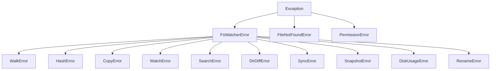

# Exceptions

All pyfs-watcher exceptions inherit from `FsWatcherError`, which itself inherits from Python's built-in `Exception`. Standard `FileNotFoundError` and `PermissionError` are raised for I/O errors.

## Hierarchy



---

## FsWatcherError

```python
class FsWatcherError(Exception)
```

Base exception for all pyfs-watcher errors. Catch this to handle any library-specific error.

```python
try:
    pyfs_watcher.walk_collect("/some/path")
except pyfs_watcher.FsWatcherError as e:
    print(f"pyfs-watcher error: {e}")
```

---

## WalkError

```python
class WalkError(FsWatcherError)
```

Raised when a directory walk operation fails. Typically occurs when the root path cannot be read.

---

## HashError

```python
class HashError(FsWatcherError)
```

Raised when a file hashing operation fails. This can occur when a file is unreadable or when the thread pool cannot be created for parallel hashing.

---

## CopyError

```python
class CopyError(FsWatcherError)
```

Raised when a copy or move operation fails. Common causes include destination already exists (when `overwrite=False`), disk full, or permission denied.

---

## WatchError

```python
class WatchError(FsWatcherError)
```

Raised when a file watching operation fails. Typically occurs when the watched path does not exist or the OS watcher cannot be initialized.

---

## SearchError

```python
class SearchError(FsWatcherError)
```

Raised when a content search operation fails. Typically occurs when the root path does not exist or the regex pattern is invalid.

---

## DirDiffError

```python
class DirDiffError(FsWatcherError)
```

Raised when a directory diff operation fails. Typically occurs when a source or target directory does not exist.

---

## SyncError

```python
class SyncError(FsWatcherError)
```

Raised when a sync operation fails. Typically occurs when the source directory does not exist.

---

## SnapshotError

```python
class SnapshotError(FsWatcherError)
```

Raised when a snapshot or verify operation fails. This can occur when the path is not a directory, the snapshot JSON is malformed, or the snapshot root no longer exists during verification.

---

## DiskUsageError

```python
class DiskUsageError(FsWatcherError)
```

Raised when a disk usage operation fails. Typically occurs when the path does not exist or is not a directory.

---

## RenameError

```python
class RenameError(FsWatcherError)
```

Raised when a bulk rename operation fails. This can occur when the path is not a directory, the regex pattern is invalid, or an undo is attempted on a dry-run result.

---

## Catching Strategies

### Catch everything from pyfs-watcher

```python
try:
    # any pyfs-watcher operation
    ...
except pyfs_watcher.FsWatcherError as e:
    print(f"Library error: {e}")
except (FileNotFoundError, PermissionError) as e:
    print(f"I/O error: {e}")
```

### Catch specific errors

```python
try:
    result = pyfs_watcher.hash_file(path)
except FileNotFoundError:
    # File doesn't exist
    ...
except pyfs_watcher.HashError:
    # Hashing-specific failure
    ...
```
