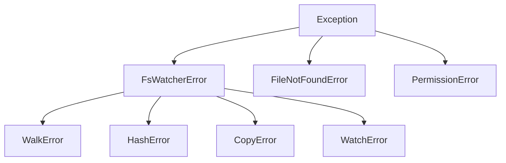

# Getting Started

## Installation

=== "pip"

    ```bash
    pip install pyfs_watcher
    ```

=== "uv"

    ```bash
    uv add pyfs_watcher
    ```

=== "From source"

    ```bash
    pip install maturin
    git clone https://github.com/pratyush618/pyfs-watcher.git
    cd pyfs-watcher
    maturin develop --release
    ```

### Verify installation

```python
import pyfs_watcher
print(pyfs_watcher.__all__)
```

---

## Quick Tour

The script below exercises all five feature modules. Create a file called `tour.py` and run it:

```python
import tempfile
import os
import pyfs_watcher

# Create a temporary workspace
with tempfile.TemporaryDirectory() as tmp:
    # Create some sample files
    for name in ["hello.py", "world.py", "data.txt", "notes.txt"]:
        path = os.path.join(tmp, name)
        with open(path, "w") as f:
            f.write(f"content of {name}\n")

    # Create a duplicate
    dup = os.path.join(tmp, "hello_copy.py")
    with open(dup, "w") as f:
        f.write("content of hello.py\n")

    # ── 1. Walk ──
    print("=== Walk ===")
    entries = pyfs_watcher.walk_collect(tmp, file_type="file", sort=True)
    for entry in entries:
        print(f"  {entry.path} ({entry.file_size}B)")

    # ── 2. Hash ──
    print("\n=== Hash ===")
    result = pyfs_watcher.hash_file(os.path.join(tmp, "hello.py"))
    print(f"  {result.path}: {result.hash_hex[:16]}... ({result.algorithm})")

    paths = [e.path for e in entries]
    results = pyfs_watcher.hash_files(paths, algorithm="blake3")
    print(f"  Hashed {len(results)} files in parallel")

    # ── 3. Copy ──
    print("\n=== Copy ===")
    dest = os.path.join(tmp, "backup")
    os.makedirs(dest)
    copied = pyfs_watcher.copy_files(
        [os.path.join(tmp, "hello.py"), os.path.join(tmp, "world.py")],
        dest,
        progress_callback=lambda p: print(
            f"  {p.files_completed}/{p.total_files} files copied"
        ),
    )
    print(f"  Copied to: {copied}")

    # ── 4. Dedup ──
    print("\n=== Dedup ===")
    groups = pyfs_watcher.find_duplicates([tmp], min_size=1)
    for g in groups:
        print(f"  {len(g.paths)} copies, {g.wasted_bytes}B wasted:")
        for p in g.paths:
            print(f"    {p}")

    # ── 5. Watch ──
    print("\n=== Watch ===")
    print("  (FileWatcher is a blocking iterator — see the Watch guide)")
```

---

## Exception Hierarchy

All pyfs-watcher exceptions inherit from a single base class, making it easy to catch broad or specific errors:



```python
try:
    pyfs_watcher.hash_file("/nonexistent")
except FileNotFoundError:
    print("File doesn't exist")
except pyfs_watcher.HashError as e:
    print(f"Hashing failed: {e}")
except pyfs_watcher.FsWatcherError as e:
    print(f"Some pyfs-watcher error: {e}")
```

---

## Next Steps

Dive into the individual feature guides:

- [Walk](guides/walk.md) — Directory traversal
- [Hash](guides/hash.md) — File hashing
- [Copy/Move](guides/copy-move.md) — Bulk file operations
- [Watch](guides/watch.md) — Filesystem monitoring
- [Dedup](guides/dedup.md) — Duplicate detection

Or jump to the [API Reference](api/index.md) for complete function signatures.
